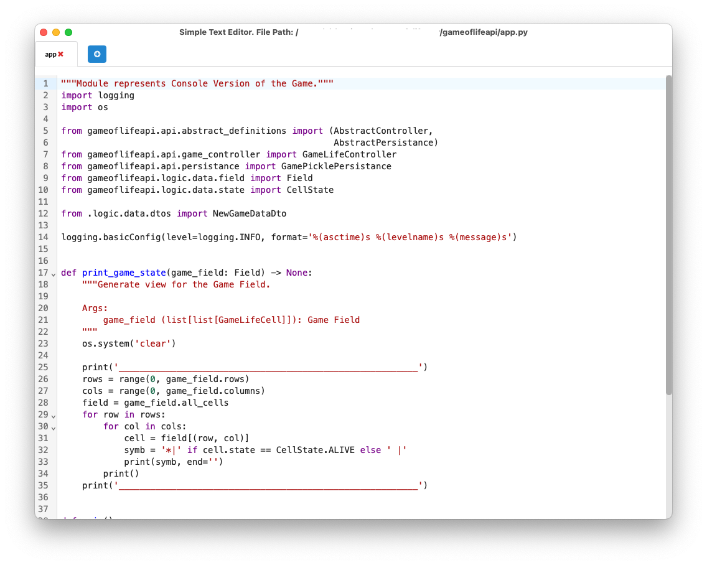
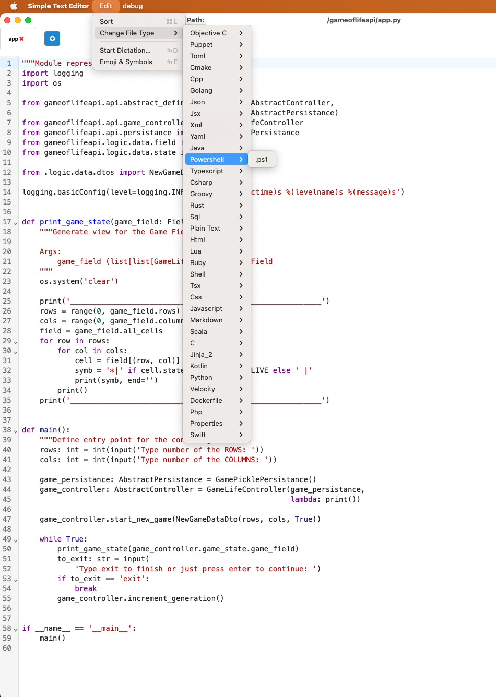

# simple_text_edit_go

Simple text editor written on Golang

## About

This is a POC of text editor that is has Go backend and ReactJs frontend.

There was an idea to create simple text editor that will be work fast and provide basic editing functionality.

## How it looks like





## What was used

- **OS**: Mac OS Monterey 12.6.4 (Intel)
- [Golang 1.20](https://golang.google.cn/) - Probably the fastest language after C/C++, that is awesome, but hard to use
  after Java/Python/JS/Typescript and other similar languages.
- [Wails library v2.4.0](https://wails.io/) - Awesome alternative to the [ElectronJs](https://www.electronjs.org/) for
  Go. But probably not such powerful and feature rich (but I hope in future that will be changed)
- [NodeJs v18.14.2](https://nodejs.org/) - No comments, required for development frontend on Js/Typescript
- [Semantic UI ReactJs library](https://react.semantic-ui.com/) - Good and simple library for building UI. Has enough
  ready to use components.
- [React Codemirror library and plugins for editor functionality](https://uiwjs.github.io/react-codemirror/) - Awesome
  library that implements text editor for Browser/WebKit. Has all required functionality to create Code Editor.

As a result we have fast backend, rich editing functionality and simple UI

## How to build

### Install Golang

You can use official installer for [Go](https://golang.google.cn/dl/) or for example use on
MacOS [brew formulae](https://formulae.brew.sh/formula/go), or any other possible options for your OS.

Do not forget that Go should be added to PATH variable

Example:

```shell
export GOPATH=$(go env GOPATH)
export PATH=$PATH:$(go env GOPATH)/bin
```

### Install Wails

You can follow by instruction on [official documentation](https://wails.io/docs/gettingstarted/installation)

### Install Node JS and NPM

You can find NodeJS installer on [official nodejs site](https://nodejs.org/en/download) or find other ways to install
node on your OS, like on MacOS [brew formulae](https://formulae.brew.sh/formula/node)

### Download sources

In order to build this project - download sources or clone repository

### Build project

In order to build project - the simplest way is to use Wails CLI

```shell
cd to/project_directory/simple_text_edit_go

wails dev # in order to start project in development mode

wails build # in order to build binary for your OS. Binary can be found in proj_dir/build/bin
```

# Plans

This is more a POC that has bugs and not completed functionality, so it will be improved in the future. 